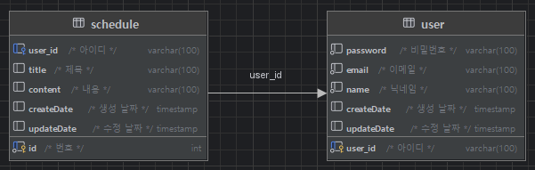

## 📆일정 관리 앱
### 일정을 `등록/조회/수정/삭제` 할 수 있는 웹페이지.

### 📖요구사항
<details><summary><b>요구사항 (펼치기/접기)</b></summary>

1. 사용자 관리
    - 사용자 등록
        - `이메일`, `이름`, `비밀번호`을 입력받아 사용자를 생성한다.
        - 생성시 `등록일`을 자동으로 입력한다.
        - 비밀번호는 `DB`에 `암호화`하여 저장된다.
        - 유저의 권한을 등록한다. (`관리자`, `일반 사용자`)
    - 사용자 조회
        - `JWT`과 `필터`를 사용하여 로그인 기능을 구현한다.
        - `회원가입`과 `로그인`을 제외한 모든 요청에서 `토큰`을 활용하여 인증 처리한다.
    - 사용자 수정
        - 사용자 정보를 `수정`할 수 있다. 
        - 수정시 `수정날짜`를 자동으로 갱신한다.
    - 사용자 삭제
        - 탈퇴 버튼을 클릭하여 탈퇴한다.
        - `탈퇴한 회원`과 `연관된 게시글`을 모두 삭제한다.
2. 일정 관리
    - 일정 등록
        - `로그인`한 회원에 한해서 게시글을 작성할 수 있다.
        - `제목`, `내용`을 입력하여 일정을 등록한다.
        - `작성/수정일`은 날짜와 시간을 모두 포함한 형태이다.
        - 등록시 외부 `API`를 활용하여 `날씨`를 등록한다.
    - 일정 조회
        - 모든 일정을 조회할 수 있다.
        - `수정일`을 기준으로 내림차순 정렬한다.
        - 한페이지에 사용자가 `선택한 갯수`만큼 일정을 표시한다.
        - 기본 페이지 크기는 `10`이다.
    - 일정 수정
        - 선택한 일정의 `할일`을 수정할 수 있다.
        - `관리자 권한`을 가진 유저만 일정을 `수정`할 수 있다.
    - 일정 삭제
        - `선택한 일정`을 삭제한다.
        - 삭제할땐 `비밀번호`를 함께 입력해야 한다.
        - `관리자 권한`을 가진 유저만 일정을 `삭제`할 수 있다.
        - 연관된 `댓글`을 모두 삭제한다.
3. 댓글 관리
    - 생성된 일정에 `댓글`을 남길 수 있다.
    - 댓글을 `조회`, `수정`, `삭제`할 수 있다.
    - 본인이 작성한 댓글만 `삭제`할 수 있다.
</details>

### 🗂️프로젝트 구조 및 설명
<details><summary><b>프로젝트 구조 및 설명(펼치기/접기)</b></summary> 

```bash
'src'                                                           # 일정 관리 프로젝트 관련 패키지와 소스 코드를 모아놓은 폴더 
 ├── 'main'
 │   └── 'java.com.sparta.schedule_project'                     # 일정 관리 프로젝트 
 │        ├── ScheduleProjectApplication.java                   # 시작 함수가 있는 class 
 │        ├── 'infra'                                           # 외부 API 연동과 관련된 폴더와 클래스들을 모아놓은 폴더
 │        │    └── WeatherApiService.java                       # 현재 날씨를 외부 API로부터 받아도는 서비스 class
 │        │
 │        ├── 'config'                                          # 프로젝트 설정 관련 class들을 모아놓은 폴더
 │        │    ├── PasswordEncoder.java                         # 비밀번호에 대한 암호화 및 대조 기능을 지원하는 class
 │        │    └── PasswordConfig.java                          # 비밀번호 관련 설정 (암호화 등)을 담당하는 class
 │        │
 │        ├── 'enums'                                           # 프로젝트에서 사용되는 enum들을 모아놓은 폴더
 │        │    ├── AuthType.java                                # 용자 권한 종류를 나타내는 enum
 │        │    ├── LoginType.java                               # 로그인 방식을 나타내는 enum
 │        │    ├── ResponseCode.java                            # API 응답 시 사용되는 상태 코드와 메시지를 정의하는 enum
 │        │    └── TokenType.java                               # 큰을 어디에 넣을지 나타내는 enum
 │        │
 │        ├── 'token'                                           # 토큰 관련 클래스들을 모아놓은 폴더
 │        │    ├── TokenProvider.java                           # 상속받아 사용하는 TokenProvider interface
 │        │    ├── TokenProviderManager.java                    # HTTP 요청에 따라 토큰 제공자를 선택하여 반환하는 class
 │        │    ├── JwtCookieTokenProvider.java                  # JWT를 이용하여 쿠키에 사용자 정보를 저장하고 인증을 처리하는 class
 │        │    ├── JwtHeaderTokenProvider.java                  # JWT를 이용하여 헤더에 사용자 정보를 저장하고 인증을 처리하는 class
 │        │    ├── CookieManager.java                           # 쿠키 관련 기능을 제공하는 class
 │        │    └── JwtUtil.java                                 # JWT 토큰 생성 및 검증을 수행하는 class
 │        │ 
 │        ├── 'filter'                                          # 필터들을 모아놓은 폴더
 │        │    ├── AuthFilter.java                              # 인증 필터 (로그인 여부 확인 등)
 │        │    ├── ExceptionFilter.java                         # 예외처리 필터
 │        │    └── LoggingFilter.java                           # 로그 필터 (요청/응답 로그 기록)
 │        │
 │        ├── 'controller'                                      # 사용자 요청을 처리하기 위한 컨트롤러를 모아놓은 폴더 
 │        │    ├── ScheduleController.java                      # 일정 관련 요청을 처리하는 컨트롤러 class 
 │        │    ├── CommentController.java                       # 댓글 관련 요청을 처리하는 컨트롤러 class 
 │        │    └── UserController.java                          # 사용자 관련 요청을 처리하는 컨트롤러 class 
 │        │
 │        ├── 'dto'                                             # 데이터를 주고받기 위한 객체를 모아놓은 폴더 
 │        │   ├── 'request'                                     # 서버에 무언가 요청할때 사용되는 폴더 및 class들을 모아놓은 폴더
 │        │   │    ├── CreateUserRequestDto.java                # 사용자를 등록 요청할 때 사용하는 dto 
 │        │   │    ├── LoginRequestDto.java                     # 로그인을 요청할 때 사용하는 dto 
 │        │   │    ├── ModifyUserRequestDto.java                # 사용자를 수정할 때 사용하는 dto 
 │        │   │    ├── CreateScheduleRequestDto.java            # 일정 정보를 등록 요청할 때 사용하는 dto 
 │        │   │    ├── ModifyScheduleRequesthDto.java           # 일정을 수정할 때 사용하는 dto 
 │        │   │    ├── CreateCommentRequesthDto.java            # 댓글을 등록 요청할 때 사용하는 dto  
 │        │   │    └── ModifyCommentRequesthDto.java            # 댓글을 수정할 때 사용하는 dto
 │        │   │
 │        │   └── 'response'                                    # 서버에서 응답할때 사용되는 폴더 및 class들을 모아놓은 폴더
 │        │        ├── ResponseStatusDto.java                   # API응답 상태에 대한 정보를 제공하는 dto    
 │        │        ├── UserResponseDto.java                     # 서버로부터 사용자 요청 처리 결과를 받을 때 사용하는 class
 │        │        ├── UserDto.java                             # 사용자 dto class
 │        │        ├── ScheduleResponseDto.java                 # 서버로부터 일정 요청 처리 결과를 받을 때 사용하는 class
 │        │        ├── ScheduleDto.java                         # 일정 dto class
 │        │        ├── CommentResponseDto.java                  # 서버로부터 댓글 요청 처리 결과를 받을 때 사용하는 class    
 │        │        ├── CommentDto.java                          # 댓글 dto class
 │        │        └── PageDto.java                             # 페이징 정보를 담는 dto class 
 │        │         
 │        ├── 'entity'                                          # DB와 매핑되는 엔티티 클래스들을 모아놓은 폴더 
 │        │    ├── Comment.java                                 # 댓글 entity 
 │        │    ├── Schedule.java                                # 일정 entity 
 │        │    ├── Timestamped.java                             # 자동으로 시간을 넣어주는 entity
 │        │    └── User.java                                    # 사용자 entity 
 │        │         
 │        ├── 'exception'                                       # 사용자 요청을 처리하기 위한 컨트롤러를 모아놓은 폴더 
 │        │    ├── GlobalExceptionHandler.java                  # 예외 처리 class
 │        │    └── ResponseException.java                       # API 응답 시 발생하는 예외를 나타내는 class 
 │        │         
 │        ├── 'repository'                                      # DB와 상호작용하는 레포지토리를 모아놓은 폴더 
 │        │    ├── ScheduleRepository.java                      # 일정을 저장하고 조회하는 기능을 제공하는 레포지토리 class 
 │        │    ├── CommentRepository.java                       # 일정을 저장하고 조회하는 기능을 제공하는 레포지토리 class 
 │        │    └── UserRepository.java                          # 사용자를 저장하고 조회하는 기능을 제공하는 레포지토리 class 
 │        │         
 │        └── 'service'                                         # 비즈니스 로직을 처리하는 서비스들을 모아놓은 폴더 
 │             ├── ScheduleService.java                         # 일정 관련 비즈니스 로직을 처리하는 class 
 │             ├── CommentService.java                          # 댓글 관련 비즈니스 로직을 처리하는 class 
 │             └── UserService.java                             # 사용자 관련 비즈니스 로직을 처리하는 class 
 └── 'docs'                                                     # 일정 관리 프로젝트와 관련된 문서들을 모아놓은 폴더 
      ├── README.md                                             # 일정 관리 프로젝트에 대한 설명을 담은 파일 
      └── schedule.sql                                          # 일정 관리 프로젝트에서 사용되는 테스트 쿼리를 모은 파일
```
</details>

### 📑API 명세서
<details><summary><b>API 명세서(펼치기/접기)</b></summary>
<table>
    <tr>
        <th>api&nbsp;&nbsp;&nbsp;&nbsp;&nbsp;&nbsp;&nbsp;&nbsp;&nbsp;&nbsp;&nbsp;&nbsp;&nbsp;&nbsp;</th>
        <th>Method</th>
        <th>URL</th>
        <th>request header</th>
        <th>request</th>
        <th>response header</th>
        <th>response</th>                               
<th>status&nbsp;&nbsp;&nbsp;&nbsp;&nbsp;&nbsp;&nbsp;&nbsp;&nbsp;&nbsp;&nbsp;&nbsp;&nbsp;&nbsp;&nbsp;&nbsp;&nbsp;&nbsp;&nbsp;&nbsp;&nbsp;&nbsp;&nbsp;&nbsp;&nbsp;&nbsp;&nbsp;&nbsp;&nbsp;&nbsp;&nbsp;&nbsp;&nbsp;&nbsp;&nbsp;&nbsp;&nbsp;&nbsp;&nbsp;&nbsp;&nbsp;&nbsp;&nbsp;&nbsp;&nbsp;&nbsp;&nbsp;&nbsp;&nbsp;&nbsp;
        </th>
    </tr>
    <tr>
        <td><b>회원 가입</b></td>
        <td><span style=background-color:#786E12AA;font-weight:bold;>POST</span></td>
        <td><span>/api/signup</span></td>
        <td>RequestBody</td>
        <td><pre lang="json">{     
    "email": "hong@gmail.com",
    "password": "1q2w3e4r#",
    "name": "홍길동",
    "auth": "ADMIN"
}</pre></td>
        <td>application/json</td>
        <td><pre lang="json">{
    "message": "create user success",
    "status": 200
}</pre></td>
        <td>
            <span style=background-color:yellow;font-weight:bold;color:black;>201</span>: 사용자 정상등록<br/>
            <span style=background-color:skyblue;font-weight:bold;color:black;>409</span>: 중복된 이메일
        </td>
    </tr>
    <tr>
        <td><b>로그인</b></td>
        <td><span style=background-color:#786E12AA;font-weight:bold;>POST</span></td>
        <td><span>/api/login</span></td>
        <td>RequestBody</td>
        <td><pre lang="json">{
    "email" : "hong@email.com",
    "password" : "1q2w3e4r#"
}</pre></td>
        <td>application/json</td>
        <td><pre lang="json">{
    "message": "login success",
    "status": 201
}</pre></td>
        <td>
            <span style=background-color:yellow;font-weight:bold;color:black;>200</span>: 로그인 성공<br/>
            <span style=background-color:skyblue;font-weight:bold;color:black;>400</span>: 잘못된 값 입력<br/>
            <span style=background-color:skyblue;font-weight:bold;color:black;>401</span>: 일치하지 않는 비밀번호<br/>
            <span style=background-color:skyblue;font-weight:bold;color:black;>404</span>: 존재하지 않는 유저
        </td>
    </tr>
    <tr>
        <td><b>사용자<br/>정보 조회</b></td>
        <td><span style=background-color:#22741CAA;font-weight:bold;>GET</span></td>
        <td><span>/api<br/>/users/{userId}</span></td>
        <td>PathVariable</td>
        <td><code>N/A</code></td>
        <td>application/json</td>
        <td><pre lang="json">{
    "user": {
        "id": 1,
        "email": "hong@gmail.com",
        "password": "1q2w3e4r#",
        "name": "홍길동",
        "auth": "ADMIN"
    },
    "status": {
        "message": "search user success",
        "status": 200
    }
}</pre></td>
        <td>
            <span style=background-color:yellow;font-weight:bold;color:black;>200</span>: 사용자 정보 조회 성공<br/>
            <span style=background-color:skyblue;font-weight:bold;color:black;>400</span>: 토큰이 없음<br/>
            <span style=background-color:skyblue;font-weight:bold;color:black;>401</span>: 토큰 유효기간 만료<br/>
            <span style=background-color:skyblue;font-weight:bold;color:black;>401</span>: 지원하지 않는 토큰 형식<br/>
            <span style=background-color:skyblue;font-weight:bold;color:black;>403</span>: 권한이 없음<br/>
            <span style=background-color:skyblue;font-weight:bold;color:black;>404</span>: 존재하지 않는 유저<br/>
            <span style=background-color:skyblue;font-weight:bold;color:black;>404</span>: 잘못된 JWT 토큰
        </td>
    </tr>
    <tr>
        <td><b>사용자<br/>수정</b></td>
        <td><span style=background-color:#3B36CFAA;font-weight:bold;>PUT</span></td>
        <td><span>/api<br/>/users/{userId}</span></td>
        <td>PathVariable<br/>RequestBody</td>
        <td><pre lang="json">{    
    "userId": 1,        
    "password": "1q2w3e4r#",
    "name": "김길동"
}</pre></td>
        <td>application/json</td>
        <td><pre lang="json">{
    "message": "update user success",
    "status": 200
}</pre></td>
        <td>
            <span style=background-color:yellow;font-weight:bold;color:black;>200</span>: 사용자 정상수정<br/>
            <span style=background-color:skyblue;font-weight:bold;color:black;>400</span>: 잘못된 값 입력<br/>
            <span style=background-color:skyblue;font-weight:bold;color:black;>400</span>: 토큰이 없음<br/>
            <span style=background-color:skyblue;font-weight:bold;color:black;>401</span>: 토큰 유효기간 만료<br/>
            <span style=background-color:skyblue;font-weight:bold;color:black;>401</span>: 지원하지 않는 토큰 형식<br/>
            <span style=background-color:skyblue;font-weight:bold;color:black;>403</span>: 수정 권한이 없음<br/>
            <span style=background-color:skyblue;font-weight:bold;color:black;>404</span>: 존재하지 않는 유저<br/>
            <span style=background-color:skyblue;font-weight:bold;color:black;>404</span>: 잘못된 JWT 토큰
        </td>
    </tr>
    <tr>
        <td><b>사용자<br/>삭제</b></td>
        <td><span style=background-color:#CE3636AA;font-weight:bold;>DELETE</span></td>
        <td><span>/api<br/>/users/{userId}</span></td>
        <td>PathVariable</td>
        <td><code>N/A</code></td>
        <td>application/json</td>
        <td><pre lang="json">{
    "message": "delete user success",
    "status": 204
}</pre></td>
        <td>
            <span style=background-color:yellow;font-weight:bold;color:black;>204</span>: 사용자 정상삭제<br/>
            <span style=background-color:skyblue;font-weight:bold;color:black;>400</span>: 토큰이 없음<br/>
            <span style=background-color:skyblue;font-weight:bold;color:black;>401</span>: 토큰 유효기간 만료<br/>
            <span style=background-color:skyblue;font-weight:bold;color:black;>401</span>: 지원하지 않는 토큰 형식<br/>
            <span style=background-color:skyblue;font-weight:bold;color:black;>403</span>: 삭제 권한이 없음<br/>
            <span style=background-color:skyblue;font-weight:bold;color:black;>404</span>: 존재하지 않는 유저<br/>
            <span style=background-color:skyblue;font-weight:bold;color:black;>404</span>: 잘못된 JWT 토큰
        </td>
    </tr>
    <tr>
        <td><b>일정 등록</b></td>
        <td><span style=background-color:#786E12AA;font-weight:bold;>POST</span></td>
        <td><span>/api/{userId}<br/>/schedules</span></td>
        <td>PathVariable<br/>RequestBody</td>
        <td><pre lang="json">{
    "title": "제목제목제목",
    "content": "내용내용내용"
}</pre></td>
        <td>application/json</td>
        <td><pre lang="json">{
    "message": "create schedule success",
    "status": 201
}</pre></td>
        <td>
            <span style=background-color:yellow;font-weight:bold;color:black;>201</span>: 일정 정상등록<br/>
            <span style=background-color:skyblue;font-weight:bold;color:black;>400</span>: 토큰이 없음<br/>
            <span style=background-color:skyblue;font-weight:bold;color:black;>400</span>: 잘못된 내용 입력<br/>
            <span style=background-color:skyblue;font-weight:bold;color:black;>401</span>: 토큰 유효기간 만료<br/>
            <span style=background-color:skyblue;font-weight:bold;color:black;>401</span>: 지원하지 않는 토큰 형식<br/>
            <span style=background-color:skyblue;font-weight:bold;color:black;>404</span>: 잘못된 JWT 토큰
        </td>
    </tr>
    <tr>
        <td><b>일정 조회</b></td>
        <td><span style=background-color:#22741CAA;font-weight:bold;>GET</span></td>
        <td><span>/api/{userId}<br/>/schedules</span></td>
        <td>PathVariable<br/>RequestParam</td>
        <td><code>N/A</code></td>
        <td>allpication/json</td>
        <td><pre lang="json">{
    "schedules": [
        {
            "id": 3,
            "userId": 1,
            "userName": "홍길동",
            "title": "제목제목제목",
            "content": "내용내용내용",
            "weather": "맑다",
            "createDate": "2024-10-16T09:31:05.4463",
            "updateDate": "2024-10-16T09:31:05.4463"
        },
        {
            "id": 2,
            "userId": 1,
            "userName": "이길동",
            "title": "제목제목제목22",
            "content": "내용내용내용22",
            "weather": "맑다",
            "createDate": "2024-10-16T09:30:59.460334",
            "updateDate": "2024-10-16T09:30:59.460334"
        }
    ],
    "page": {
        "page": 1,
        "size": 2,
        "totalPage": 3
    },
    "status": {
        "state": 200,
        "message": "일정 조회 성공"
    }
}</pre></td>
        <td>
            <span style=background-color:yellow;font-weight:bold;color:black;>200</span>: 일정 정상조회<br/>
            <span style=background-color:skyblue;font-weight:bold;color:black;>400</span>: 토큰이 없음<br/>
            <span style=background-color:skyblue;font-weight:bold;color:black;>401</span>: 토큰 유효기간 만료<br/>
            <span style=background-color:skyblue;font-weight:bold;color:black;>401</span>: 지원하지 않는 토큰 형식<br/>
            <span style=background-color:skyblue;font-weight:bold;color:black;>404</span>: 잘못된 JWT 토큰
        </td>
    </tr>
    <tr>
        <td><b>일정 수정</b></td>
        <td><span style=background-color:#3B36CFAA;font-weight:bold;>PUT</span></td>
        <td><span>/api/{userId}<br/>/schedules/{scheduleId}</span></td>
        <td>PathVariable<br/>RequestBody</td>
        <td><pre lang="json">{
    "scheduleId": 1,
    "title" : "제목제목제목",
    "content" : "수정수정수정"
}</pre></td>
        <td>application/json</td>
        <td><pre lang="json">{
    "message": "update schedule success",
    "status": 200
}</pre></td>
        <td>
            <span style=background-color:yellow;font-weight:bold;color:black;>200</span>: 일정 정상수정<br/>
            <span style=background-color:skyblue;font-weight:bold;color:black;>400</span>: 토큰이 없음<br/>
            <span style=background-color:skyblue;font-weight:bold;color:black;>400</span>: 잘못된 값 입력<br/>
            <span style=background-color:skyblue;font-weight:bold;color:black;>401</span>: 토큰 유효기간 만료<br/>
            <span style=background-color:skyblue;font-weight:bold;color:black;>401</span>: 지원하지 않는 토큰 형식<br/>
            <span style=background-color:skyblue;font-weight:bold;color:black;>403</span>: 권한이 없음<br/>
            <span style=background-color:skyblue;font-weight:bold;color:black;>404</span>: 잘못된 JWT 토큰<br/>
            <span style=background-color:skyblue;font-weight:bold;color:black;>404</span>: 삭제된 일정
        </td>
    </tr>
    <tr>
        <td><b>일정 삭제</b></td>
        <td><span style=background-color:#CE3636AA;font-weight:bold;>DELETE</span></td>
        <td><span>/api/{userId}<br/>/schedules/{scheduleId}</span></td>
        <td>PathVariable</td>
        <td><code>N/A</code></td>
        <td>application/json</td>
        <td><pre lang="json">{
    "message": "delete schedule success",
    "status": 200
}</pre></td>
        <td>
            <span style=background-color:yellow;font-weight:bold;color:black;>200</span>: 일정 정상삭제<br/>
            <span style=background-color:skyblue;font-weight:bold;color:black;>400</span>: 토큰이 없음<br/>
            <span style=background-color:skyblue;font-weight:bold;color:black;>401</span>: 토큰 유효기간 만료<br/>
            <span style=background-color:skyblue;font-weight:bold;color:black;>401</span>: 지원하지 않는 토큰 형식<br/>
            <span style=background-color:skyblue;font-weight:bold;color:black;>403</span>: 권한이 없음<br/>
            <span style=background-color:skyblue;font-weight:bold;color:black;>404</span>: 잘못된 JWT 토큰<br/>
            <span style=background-color:skyblue;font-weight:bold;color:black;>404</span>: 삭제된 일정
        </td>
    </tr>
    <tr>
        <td><b>댓글 등록</b></td>
        <td><span style=background-color:#786E12AA;font-weight:bold;>POST</span></td>
        <td><span>/api/{userId}<br/>/schedule/{scheduleId}<br/>/comments</span></td>
        <td>PathVariable<br/>RequestBody</td>
        <td><pre lang="json">{     
    "scheduleId": 1,
    "content": "댓글댓글댓글"
}</pre></td>
        <td>application/json</td>
        <td><pre lang="json">{
    "message": "create comment success",
    "status": 201
}</pre></td>
        <td>
            <span style=background-color:yellow;font-weight:bold;color:black;>201</span>: 댓글 정상등록<br/>
            <span style=background-color:skyblue;font-weight:bold;color:black;>400</span>: 토큰이 없음<br/>
            <span style=background-color:skyblue;font-weight:bold;color:black;>400</span>: 잘못된 값 입력<br/>
            <span style=background-color:skyblue;font-weight:bold;color:black;>401</span>: 토큰 유효기간 만료<br/>
            <span style=background-color:skyblue;font-weight:bold;color:black;>401</span>: 지원하지 않는 토큰 형식<br/>
            <span style=background-color:skyblue;font-weight:bold;color:black;>403</span>: 권한이 없음<br/>
            <span style=background-color:skyblue;font-weight:bold;color:black;>404</span>: 잘못된 JWT 토큰
        </td>
    </tr>
        <tr>
        <td><b>일정 댓글 조회</b></td>
        <td><span style=background-color:#22741CAA;font-weight:bold;>GET</span></td>
        <td><span>/api/{userId}<br/>/schedule/{scheduleId}<br/>/comments</span></td>
        <td>PathVariable<br/>RequestParam</td>
        <td><code>N/A</code></td>
        <td>application/json</td>
        <td><pre lang="json">{
    "comment": [{
        "id": 1,
        "userId": 1,
        "scheduleId" : 1,
        "content" : "댓글댓글댓글",
        "createDate": "2022-10-16",
        "updateDate": "2022-10-20"
    },
    {
        "id": 2,
        "userId": 1,
        "scheduleId" : 1,
        "content" : "댓글댓글댓글22",
        "createDate": "2022-10-16",
        "updateDate": "2022-10-20"
    }],
    "page": {
        "page": 1,
        "size": 2,
        "totalPage": 3
    },
    "status": {
        "message": "search comment success",
        "status": 200
    },
}</pre></td>
        <td>
            <span style=background-color:yellow;font-weight:bold;color:black;>200</span>: 댓글 정상조회<br/>
            <span style=background-color:skyblue;font-weight:bold;color:black;>400</span>: 토큰이 없음<br/>
            <span style=background-color:skyblue;font-weight:bold;color:black;>401</span>: 토큰 유효기간 만료<br/>
            <span style=background-color:skyblue;font-weight:bold;color:black;>401</span>: 지원하지 않는 토큰 형식<br/>
            <span style=background-color:skyblue;font-weight:bold;color:black;>404</span>: 잘못된 JWT 토큰
        </td>
    </tr>
    <tr>
        <td><b>댓글 수정</b></td>
        <td><span style=background-color:#3B36CFAA;font-weight:bold;>PUT</span></td>
        <td><span>/api/{userId}<br/>/schedule/{scheduleId}<br/>/comments/{commentId}</span></td>
        <td>PathVariable<br/>RequestBody</td>
        <td><pre lang="json">{
    "commentId": 1,
    "content" : "댓글 수정수정수정"
}</pre></td>
        <td>application/json</td>
        <td><pre lang="json">{
    "message": "update comment success",
    "status": 200
}</pre></td>
        <td>
            <span style=background-color:yellow;font-weight:bold;color:black;>200</span>: 댓글 정상수정<br/>
            <span style=background-color:skyblue;font-weight:bold;color:black;>400</span>: 토큰이 없음<br/>
            <span style=background-color:skyblue;font-weight:bold;color:black;>400</span>: 잘못된 값 입력<br/>
            <span style=background-color:skyblue;font-weight:bold;color:black;>401</span>: 토큰 유효기간 만료<br/>
            <span style=background-color:skyblue;font-weight:bold;color:black;>401</span>: 지원하지 않는 토큰 형식<br/>
            <span style=background-color:skyblue;font-weight:bold;color:black;>403</span>: 권한이 없음<br/>
            <span style=background-color:skyblue;font-weight:bold;color:black;>404</span>: 잘못된 JWT 토큰<br/>
            <span style=background-color:skyblue;font-weight:bold;color:black;>404</span>: 삭제된 댓글
        </td>
    </tr>
    <tr>
        <td><b>댓글 삭제</b></td>
        <td><span style=background-color:#CE3636AA;font-weight:bold;>DELETE</span></td>
        <td><span>/api/{userId}<br/>/schedule/{scheduleId}<br/>/comments/{commentId}</span></td>
        <td>PathVariable</td>
        <td><code>N/A</code></td>
        <td>application/json</td>
        <td><pre lang="json">{
    "message": "delete comment success",
    "status": 204
}</pre></td>
        <td>
            <span style=background-color:yellow;font-weight:bold;color:black;>204</span>: 댓글 정상삭제<br/>
            <span style=background-color:skyblue;font-weight:bold;color:black;>400</span>: 토큰이 없음<br/>
            <span style=background-color:skyblue;font-weight:bold;color:black;>401</span>: 토큰 유효기간 만료<br/>
            <span style=background-color:skyblue;font-weight:bold;color:black;>401</span>: 지원하지 않는 토큰 형식<br/>
            <span style=background-color:skyblue;font-weight:bold;color:black;>403</span>: 권한이 없음<br/>
            <span style=background-color:skyblue;font-weight:bold;color:black;>404</span>: 잘못된 JWT 토큰<br/>
            <span style=background-color:skyblue;font-weight:bold;color:black;>404</span>: 삭제된 댓글
        </td>
    </tr>          
</table>
</details>

### 📋ERD
<details><summary><b>ERD (펼치기/접기)</b></summary>

</details>


### 🖥️개발환경
- `Window 11`
- `JDK 1.8`
- `DataBase - MySQL`
- `PostMan`

### 💫Denpendencies
- `Lombok`
- `Spring Web`
- `JDBC API`
- `Spring Data JPA`
- `MySQL Driver`
- `Validation`
- `CycloneDX SBOM support`

### 🔨개발 툴
- `Intellij`
- `Github`

### 🧑‍💻사용언어
- `Java`