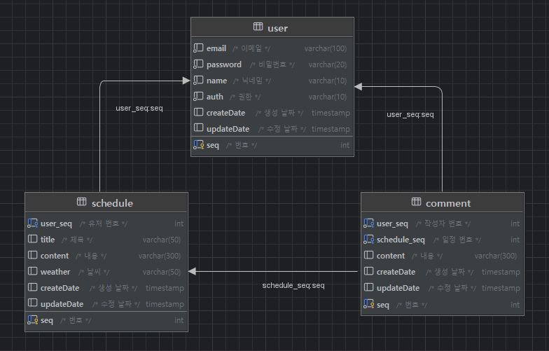

## 📆일정 관리 앱
일정을 `등록/조회/수정/삭제` 할 수 있는 웹페이지.

### 📖요구사항
1. 사용자 관리
    - 사용자 등록
        - `이름`, `이메일`, `작성자명`, `비밀번호`을 입력받아 사용자를 생성한다.
        - 생성시 `등록일`을 자동으로 입력한다.
    - 사용자 수정
        - 사용자 정보를 `수정`할 수 있다. 
        - 수정시 `수정날짜`를 갱신한다.
    - 사용자 삭제
        - 탈퇴 버튼을 클릭하여 탈퇴한다.
        - `탈퇴한 회원`과 `연관된 게시글`을 모두 삭제한다.
2. 일정 관리
    - 일정 등록
        - `로그인`한 회원에 한해서 게시글을 작성할 수 있다.
        - `할일`, `작성/수정일`을 입력하여 일정을등록한다.
        - `작성/수정일`은 날짜와 시간을 모두 포함한 형태이다.
    - 일정 조회
        - `전체 일정`을 조회한다.
        - `수정일`과 `작성자명`을 검색조건으로 조회할 수 있다.
        - `수정일`을 기준으로 내림차순 정렬한다.
        - `페이지 번호`를 부여하여 한페이지에 사용자가 `선택한 갯수`만큼 일정을 표시한다.
    - 상세 조회
        - 선택한 일정의 `상세 페이지`를 불러온다.
    - 일정 수정
        - 선택한 일정의 `할일`을 수정할 수 있다.
    - 일정 삭제
        - `선택한 일정`을 삭제한다.
        - 삭제할땐 `비밀번호`를 함께 입력해야 한다.

### 🗂️프로젝트 구조 및 설명

<b>프로젝트 구조 및 설명(펼치기/접기)</b>

| 폴더/파일명 | 설명 |                        
|---|---|
| src | 일정 관리 프로젝트 관련 패키지와 소스 코드를 모아놓은 폴더 |
| ├── main |  |
| │    ├── java.com.sparta.schedule_project | 일정 관리 프로젝트 |
| │   │    ├── `ScheduleProjectApplication.java` | 시작 함수가 있는 class |
| │   │    ├── controller | 사용자 요청을 처리하기 위한 컨트롤러를 모아놓은 폴더 |
| │   │    │   ├── `ScheduleController.java` | 일정 관련 요청을 처리하는 컨트롤러 class |
| │   │    │   └── `UserController.java` | 사용자 관련 요청을 처리하는 컨트롤러 class |
| │   │    ├── dto | 데이터를 주고받기 위한 객체를 모아놓은 폴더 |
| │   │    │   ├── `ScheduleRequesthto.java`| 일정 정보를 요청할 때 사용하는 dto |
| │   │    │   ├── `ScheduleResponseDto.java`| 일정 정보를 받을 때 사용하는 dto |
| │   │    │   ├── `UserRequesthto.java`| 사용자 정보를 요청할 때 사용하는 dto |
| │   │    │   ├── `UserResponseDto.java`| 사용자 정보를 받을 때 사용하는 dto |
| │   │    │   └── entity| DB와 매핑되는 엔티티 클래스들을 모아놓은 폴더 |
| │   │    │       ├── `ScheduleDto.java`| 일정 entity |
| │   │    │       └── `UserDto.java`| 사용자 entity |
| │   │    ├── repository | DB와 상호작용하는 레포지토리를 모아놓은 폴더 |
| │   │    │    ├── `ScheduleRepository.java`| 일정을 저장하고 조회하는 기능을 제공하는 레포지토리 class |
| │   │    │    └── `UserRepository.java`| 사용자를 저장하고 조회하는 기능을 제공하는 레포지토리 class |
| │   │    └── service | 비즈니스 로직을 처리하는 서비스들을 모아놓은 폴더 |
| │   │         ├── `ScheduleService.java`| 일정 관련 비즈니스 로직을 처리하는 class |
| │   │         └── `UserService.java`| 사용자 관련 비즈니스 로직을 처리하는 class |
| │   └── resources.static | 화면들을 모아놓은 폴더 |
| │       ├── `DetailSchedule.html`| 일정을 상세하게 보여주는 화면 |
| │       ├── `Index.html`| 일정 관리메인 화면 |
| │       └── `UserInfo.html`| 사용자를 등록/수정하는 화면 |
| └── docs | 일정 관리 프로젝트와 관련된 문서들을 모아놓은 폴더 |
| ├── `README.md` | 일정 관리 프로젝트에 대한 설명을 담은 파일 |
| └── `schedule.sql` | 일정 관리 프로젝트에서 사용되는 쿼리를 모은 파일 |

### 📑API 명세서

<b>API 명세서(펼치기/접기)</b>

<table>
    <tr>
        <th>기능</th>
        <th>Method</th>
        <th>URL</th>
        <th>request</th>
        <th>response</th>
        <th>상태코드</th>
    </tr>
    <tr>
        <td><b>사용자 등록</b></td>
        <td>POST</td>
        <td>/api.sparta.com/users</td>
        <td><pre lang="json">{
    "user-Id": "hong"        
    "password": "1q2w3e4r#",
    "email": "hong@gmail.com",
    "name": "홍길동"
}</pre></td>
        <td><pre lang="json">{
    "message": "create user success",
    "status": 200
}</pre></td>
        <td><code>200</code>: 사용자 정상등록</td>
    </tr>
    <tr>
        <td><b>로그인</b></td>
        <td>GET</td>
        <td>/api.sparta.com/users</td>
        <td><pre lang="json">{
    "user_Id" : "hong",
    "password" : "1q2w3e4r#"
}</pre></td>
        <td><pre lang="json">{
    "user-Id": "hong",
    "password": "1q2w3e4r#",
    "email": "hong@gmail.com",
    "name": "홍길동",
}
{
    "message": "login success",
    "status": 200
}</pre></td>
        <td><code>200</code>: 로그인 성공</td>
    </tr>
    <tr>
        <td><b>사용자 수정</b></td>
        <td>PUT</td>
        <td>/api.sparta.com/users/{userId}</td>
        <td><pre lang="json">{
    "user-Id": "hong",
    "password": "1q2w3e4r#",
    "name": "김길동",
    "email": "dong@gmail.com",
}</pre></td>
        <td><pre lang="json">{
    "message": "update user success",
    "status": 200
}</pre></td>
        <td><code>200</code>: 사용자 정상수정</td>
    </tr>
    <tr>
        <td><b>사용자 삭제</b></td>
        <td>DELETE</td>
        <td>/api.sparta.com/users/{userId}</td>
        <td><pre lang="json">{
    "user-Id": 1
}</pre></td>
        <td><pre lang="json">{
    "message": "delete user success",
    "status": 200
}</pre></td>
        <td><code>200</code>: 사용자 정상삭제</td>
    </tr>
    <tr>
        <td><b>일정 등록</b></td>
        <td>POST</td>
        <td>/api.sparta.com/schedules</td>
        <td><pre lang="json">{
    "user-id" : "1",
    "title": "제목제목제목",
    "content": "내용내용내용",
    "createDate": "2022-10-16"
}</pre></td>
        <td><pre lang="json">{
    "message": "create schedule success",
    "status": 200
}</pre></td>
        <td><code>200</code>: 일정 정상등록</td>
    </tr>
    <tr>
        <td><b>일정 조회</b></td>
        <td>GET</td>
        <td>/api.sparta.com/schedules</td>
        <td><pre lang="json">{
    "name": "홍길동",
    "startCreateDateTime" : "2022-10-16",
    "endCreateDateTime" : "2022-10-20",
    "startRowNum": "10"
    "endRowNum": "15"
}</pre></td>
        <td><pre lang="json">{
    "id": "1",
    "user-id": 1, 
    "name": "홍길동",
    "title" : "제목제목제목",
    "content" : "내용내용내용",
    "createDate": "2022-10-16",
    "updateDate": "2022-10-20"
}
{
    "message": "create schedule success",
    "status": 200
}</pre></td>
        <td><code>200</code>: 일정 정상조회</td>
    </tr>
    <tr>
        <td><b>일정 수정</b></td>
        <td>PUT</td>
        <td>/api.sparta.com/schedules{scheduleId}</td>
        <td><pre lang="json">{
    "id": "1"
    "title" : "제목제목제목",
    "content" : "수정수정수정"
}</pre></td>
        <td><pre lang="json">{
    "message": "update schedule success",
    "status": 200
}</pre></td>
        <td><code>200</code>: 일정 정상수정</td>
    </tr>
    <tr>
        <td><b>일정 삭제</b></td>
        <td>DELETE</td>
        <td>/api.sparta.com/schedules{scheduleId}</td>
        <td><pre lang="json">{
    "id" : "1",
}</pre></td>
        <td><pre lang="json">{
    "message": "delete schedule success",
    "status": 200
}</pre></td>
        <td><code>200</code>: 일정 정상삭제</td>
    </tr>
</table>

### 📋ERD

### 🖥️개발환경
- `Window 11`
- `JDK 1.8`
- `DataBase - MySQL`

### 🔨개발 툴
- `Intellij`
- `Git`
    - `Github`
    - `Github Desktop`

### 🧑‍💻사용언어
- `Java`
- `javascript`